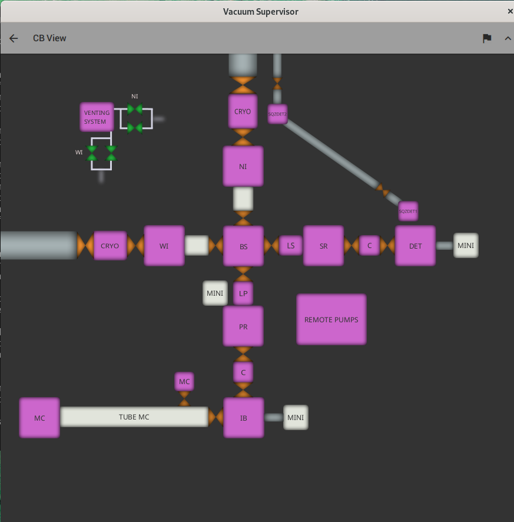
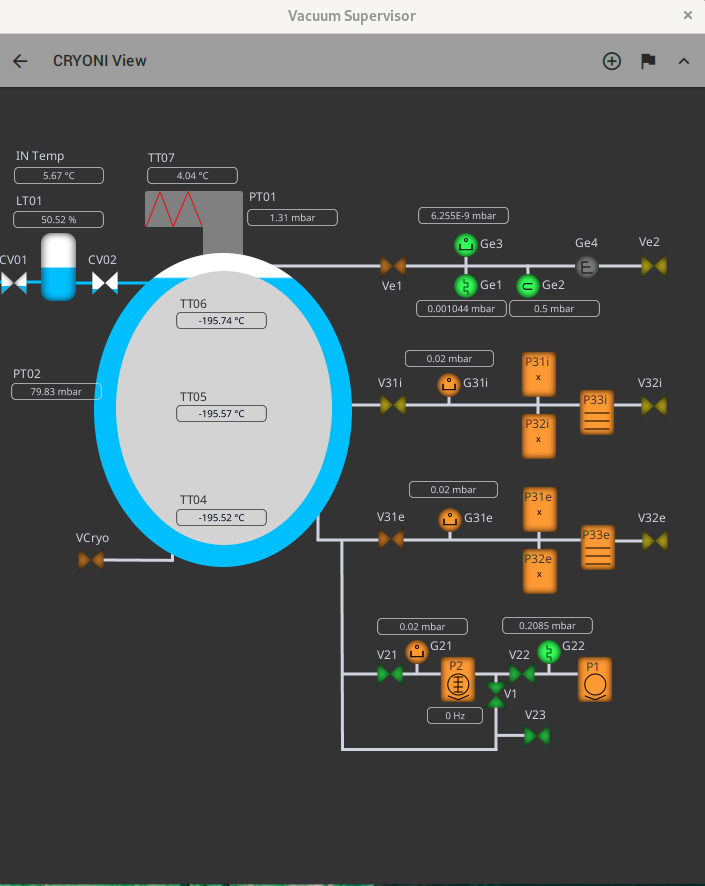
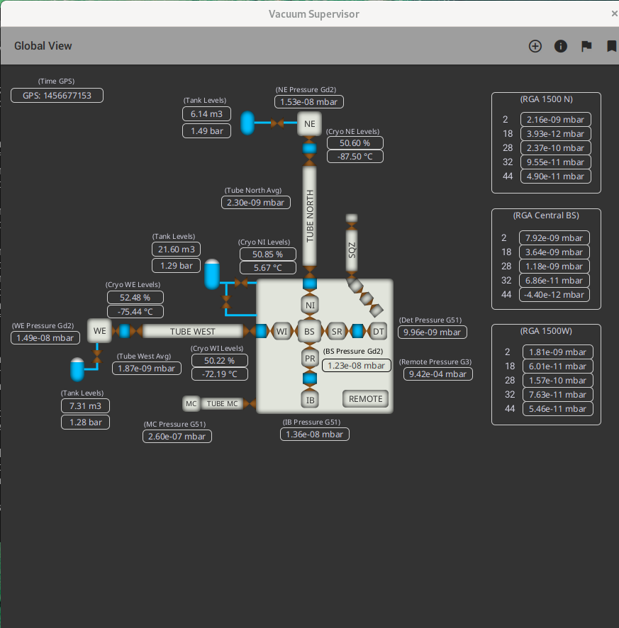
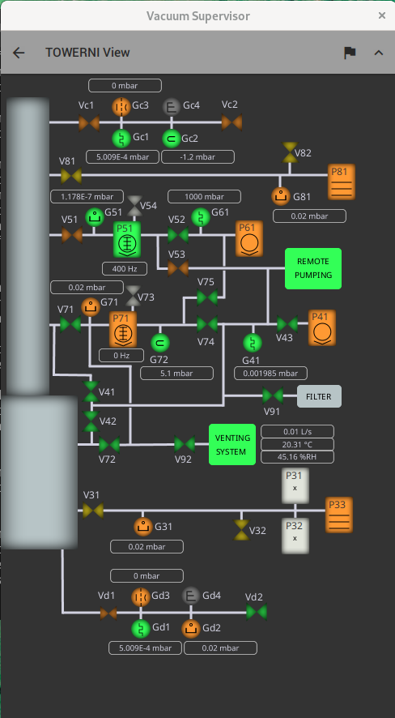

# API Overview

The VACUUM Supervisor API documentation is generated from:

- Java sources under `MainApp/src/main/java/com/gluonapplication`
- Project-level Markdown pages (`README.md`, this overview)

## Main Runtime Areas

- `View*` classes: high-level UI containers and application screens.
- FXML resources under `MainApp/src/main/resources`: UI graphics/layout built with Gluon Scene Builder.
- `Layer*` classes: reusable UI layers and dynamic visual components.
- `Controller*` classes: control flow and interaction logic.
- `DataSet*`, `DataElement`, and `DataTypes`: data model and type mappings.
- `ControlCommand`, `NotificationData`, and related classes: online provider interactions and command flow.

## Platform Validation

- Tested on Android 16.
- Not tested on iOS.

## Client Illustrations

### CB

### CRYO

### Global

### TOWER

